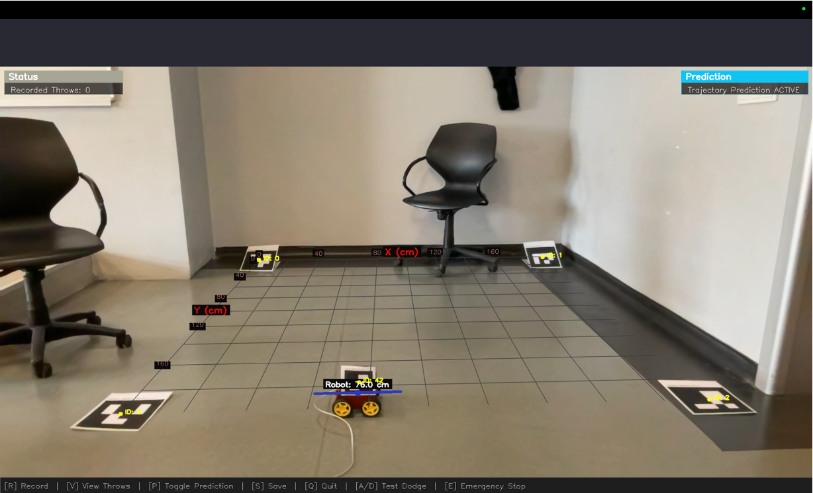
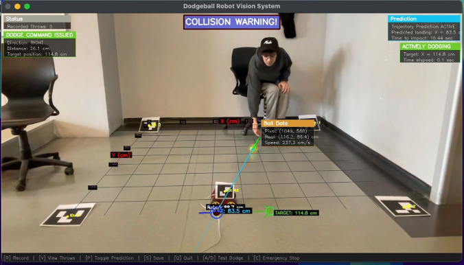
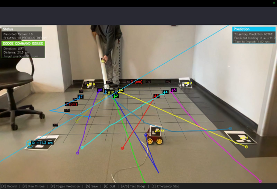

# Ball-Dodging Robot Vision System

## Overview

This capstone project combines computer vision and robotics to create an autonomous ball-dodging robot system. Using a camera positioned above the playground, the system detects an incoming ball, predicts its trajectory, determines if it will collide with the robot, and issues dodge commands if necessary to avoid collision.

The project was a collaboration between Electrical/Electronic Engineering (EEE) and Computer Engineering (CMP) teams.

## Key Features

- Real-time ball detection using color-based computer vision
- Robot position tracking using ArUco markers
- Coordinate transformation between camera view and real-world coordinates
- Ball trajectory prediction using Kalman filtering
- Collision detection algorithms with configurable parameters
- Automated dodge command generation
- Comprehensive visualization system with data panels and trajectory display
- Data recording capabilities for trajectory analysis


## For BAU students
The playground and using ArUco markers were novelties that we came up with so do not directly
copy the project, otherwise it would be obvious :)

## System Components

### Hardware Components
- Camera (mounted overhead)
- Ball-dodging robot (Arduino-controlled)
- ArUco markers for coordinate system calibration
- Tennis ball (or similar colored ball)

### Software Components
1. **Object Detection**
   - Ball detection using HSV color filtering
   - Robot detection using ArUco markers
   
2. **Coordinate Transformation**
   - Homography-based perspective transformation
   - Camera to real-world coordinate mapping
   
3. **Trajectory Prediction**
   - Kalman filter for trajectory estimation
   - Landing point calculation
   
4. **Collision Detection**
   - Real-time collision risk assessment
   - Time-to-impact estimation
   
5. **Dodge Command Generation**
   - Serial communication with robot
   - Direction and distance calculation for optimal dodging


## Installation and Setup

### Prerequisites
- Python 3.8+
- OpenCV 4.5+
- NumPy
- PySerial (for robot communication)

### Installation
1. Clone this repository:
   ```bash
   git clone https://github.com/kahvecikaan/dodgeball_robot.git
   cd dodgeball_robot
2. Install dependencies
    ```bash
   pip install opencv-python numpy pyserial
3. If using the physical robot, connect it via USB to your computer.
4. Print the ArUco markers from the `aruco_markers folder (will be generated on the first run).

### System Calibration
1. Set up the playing field with ArUco markers at the four corners:
   - Marker ID 0: Top-left corner
   - Marker ID 1: Top-right corner
   - Marker ID 2: Bottom-right corner
   - Marker ID 3: Bottom-left corner
2. Attach Marker ID 42 to the robot.
3. Run the playground calibration:
    ```bash
   python test_playground.py
4. Calibrate HSV values for ball detection (optional, use default tennis ball colors otherwise):
    ```bash
   python object_detection.py
   
## Usage

### Main System
Run the combined test script to start the full system:
```bash
  python test_combined.py
```

For testing without a physical robot (simulation mode):
```bash
  python test_combined.py --disable_dodge
```

### Controls
- R: Start/stop recording a throw
- V: Toggle visualization of previous throws
- P: Toggle trajectory prediction
- S: Save recorded throws to CSV
- C: Clear trajectory history
- X: Recalibrate the coordinate system
- A/D: Test dodge left/right (if robot connected)
- E: Emergency stop (if robot connected)
- Q: Quit

### System Architecture

1. Playground Setup (`playground_setup.py`):
   * ArUco marker detection
   * Coordinate system transformation
   * Generates printable marker images
2. Object Detection (`object_detection.py`):
   * Ball detection using color filtering
   * Robot detection using ArUco markers
   * Ball color calibration tools
3. Trajectory Prediction (`trajectory_prediction.py`):
   * Kalman filter for ball tracking
   * Future trajectory prediction
   * Time-to-impact calculations
4. Collision Detection (`collision_detection.py`):
   * Detects potential collisions between ball and robot
   * Handles various collision scenarios
   * Visualization of collision points
5. Dodge Command (`dodge_command.py`):
   * Serial communication with Arduino-controlled robot
   * Direction and distance calculation
   * Command throttling and error handling
6. Combined System (`test_combined.py`):
   * Integrates all components
   * Provides visualization and user interface
   * Records data for analysis

### Arduino Code
The Arduino code for the robot is not included in this repository. You'll need to upload code to your 
Arduino that can receive and process JSON commands in the following format:

```json
{
  "command": "dodge",
  "parameters": {
    "direction": "left",
    "distance": 20.0
  }
}
```

## Screenshots

### Robot and Playground Setup


*Fig. 1: The basic setup showing the robot with attached ArUco marker for position tracking 
and the calibrated playground coordinate system.*


### Active Collision Detection and Dodging


*Fig. 2: The system detecting a potential collision and issuing a dodge command to the robot. 
The blue trajectory shows the predicted path of the ball, with the red warning indicating collision risk.*


### Recorded Trajectory Visualization


*Fig. 3: Visualization of 10 recorded ball trajectories, demonstrating the system's ability to track 
and visualize various throwing patterns.*
